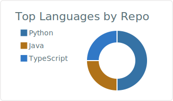
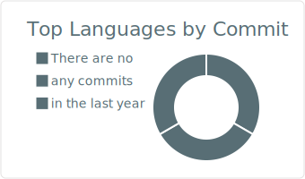

## Hi there 👋

I am **Alden Shin-Culhane**.

- 🎓 **Full Stack Software Engineer** with a **BSc in Computer Science, Co-op** from **Toronto Metropolitan University**
- 💼 Over **2 years of professional development experience** spanning **full-stack, mobile, DevOps, and cloud infrastructure**
- 🤖 Proficient in **AI-assisted engineering** — daily driver of **Claude Code** and **OpenAI Codex**, with deep experience in **prompt engineering** and building **multi-agent automation pipelines** for code review, CI, and deployment
- ☁️ Production-grade operations: **AWS**, **Azure**, **Docker**, **CI/CD (GitHub Actions, Jenkins)**, staging & production server management, observability (**OpenTelemetry**)
- 🧠 8+ years of personal and academic projects in software development
- ⚙️ I build clean, fast, and scalable tools, from internal APIs to high-traffic websites and top-rated mobile apps

## 📫 Connect with me

- [🔗 LinkedIn](https://www.linkedin.com/in/aldenshinculhane)
- [📧 Email](mailto:aldenshinculhane@gmail.com)

---

## 💼 Featured Repositories

| 📦 Repository | 📄 Description |
|---------------|----------------|
| [🔍 job-agent](https://github.com/AldenShinCulhane/job-agent) | Automated job search pipeline that discovers, scores, and applies to opportunities using multi-provider LLMs and Playwright |
| [🎫 ticket-assist](https://github.com/AldenShinCulhane/ticket-assist) | AI-powered customer support tool that drafts professional replies and generates structured ticket metadata using Claude |
| [☕ Co-op-Work-Term-2022-2023](https://github.com/AldenShinCulhane/Co-op-Work-Term-2022-2023) | Backend Java development projects from my Co-op term, including hotel data pipelines and Excel exports |
| [📘 CourseWork](https://github.com/AldenShinCulhane/CourseWork) | University coursework including Python, C, C++, Java, HTML, and more |

---

## 💻 Technical Skills

**Languages**:  
Java, Python, JavaScript, TypeScript, Swift, Kotlin, Objective-C, C#, SQL, HTML, CSS, JSON, XML, Bash, C, C++, Groovy, YAML, LaTeX, Dart, PHP, Ruby, Rust, Visual Basic, Perl, Prolog, Lisp, GLSL, CGI, Haskell, R, SAS

**Frameworks & Libraries**:  
RESTful APIs, Spring, .NET Core, ASP.NET, Node.js, Django, FastAPI, SwiftUI, UIKit, Jetpack Compose, Flutter, React, React Native, Expo, Next.js, Vue.js, AngularJS, jQuery, Maven, jOOQ, Elasticsearch, Kibana, Pandas, NumPy, Jest, Pytest, Playwright, Advanced Excel

**Developer Tools**:  
Claude Code, OpenAI Codex, Git, GitHub, GitLab, DevOps (OTel, dash0, Jenkins, GitHub Actions, CI/CD), AWS, Microsoft Azure, Firebase, Apple Developer Portal (including App Store Connect), Google Play Console, Docker, Kubernetes, Nginx, Redis, Twilio, Flyway, Matrix Synapse, Swagger, Postman, MongoDB, MySQL, PostgreSQL, Oracle SQL, NoSQL, Jira, Confluence, GitHub Issues, DBeaver, Jupyter, OpenGL, Lombok, Vim, PowerShell, Minitab, ETL, Power BI, Tableau, Crystal Reports, Google Sheets, MS Visio

**IDEs**:  
Cursor, Microsoft Visual Studio Code, Xcode, Android Studio, JetBrains IntelliJ IDEA, PyCharm, Eclipse

**Operating Systems**:  
macOS, iOS, Android, Windows, Linux, and Unix

---

## 📊 Most Used Languages

<picture>
  <source media="(prefers-color-scheme: dark)" srcset="./profile-summary-card-output/github_dark/1-repos-per-language.svg">
  
</picture>
<picture>
  <source media="(prefers-color-scheme: dark)" srcset="./profile-summary-card-output/github_dark/2-most-commit-language.svg">
  
</picture>
